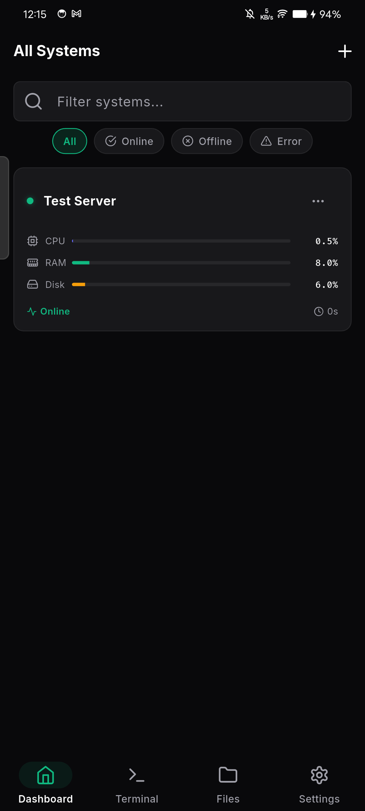
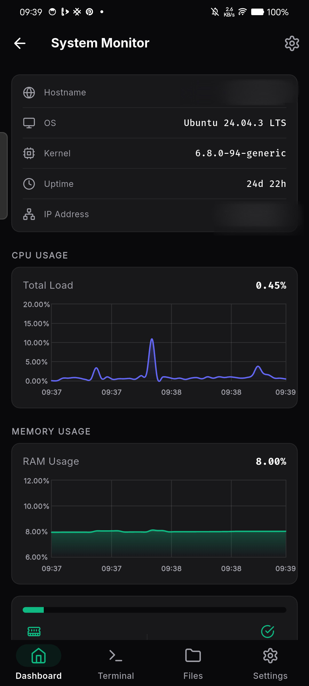
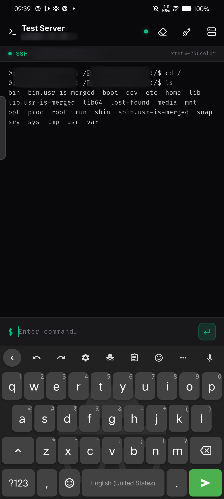

<div align="center">

# 🛰️ Orbit

### Your servers, always in sight. A sleek SSH & SFTP manager for your pocket.

[](https://github.com/yadukrishnan-h/orbit/stargazers)
[](https://github.com/yadukrishnan-h/orbit/network/members)
[](https://flutter.dev)
[](LICENSE)

</div>

---

## 📖 About the Project

**Orbit** is a mobile-first SSH and SFTP server management application built with Flutter. It gives developers, sysadmins, and hobbyists a fast, beautiful, and fully-featured way to monitor and manage their Linux servers directly from their phone — no laptop required.

At its core, Orbit establishes persistent SSH connections to your servers and continuously polls key metrics — CPU load, RAM usage, disk utilization, latency, uptime, OS distribution, and kernel version — displaying them in real-time charts and dashboards. The native SFTP subsystem lets you browse, upload, download, rename, and delete remote files with a polished file-manager UI that supports both list and grid views, multi-file selection, breadcrumb navigation, and disk usage indicators.

Orbit is designed with a clean, dark-first aesthetic and a layered feature-per-screen architecture. Each server you add gets its own persistent background monitoring session; the home screen gives you an at-a-glance fleet overview so you always know the health of every machine before you even open a dashboard.

<p align="center">
  
  
  
</p>
---

## ✨ Features

- **Fleet Overview**: Monitor all your connected servers from a single, easy-to-read dashboard.
- **Real-Time Monitoring**: Live charts tracking CPU, RAM, Disk, and Network latency.
- **Advanced SFTP Client**: Fully-featured file manager. Browse, upload, download, rename, and delete files remotely.
- **Full SSH Terminal & Command Execution**: Run terminal commands directly from your device.
- **Background Active Monitoring**: Connections stay persistent so your monitoring data is always ready when you open the app.
- **Dark-First Modern UI**: Designed for clarity, aesthetics, and smooth user experience.
- **Secure by Design**: Credentials and connections are handled securely with robust encryption.

---

## 🚀 Getting Started

### Prerequisites

- Flutter SDK (3.x or later)
- Android Studio / Xcode for deploying to emulators or physical devices.

### Installation

1. **Clone the repository**

   ```bash
   git clone https://github.com/yadukrishnan-h/orbit.git
   cd orbit
   ```

2. **Install dependencies**

   ```bash
   flutter pub get
   ```

3. **Run the application**
   ```bash
   flutter run
   ```

---

## 🛠️ Architecture & Tech Stack

- **Framework**: [Flutter](https://flutter.dev/)
- **SSH/SFTP**: Native Dart implementations for secure shell and file transfer protocols.
- **UI/UX**: Custom themed material components with a focus on dark mode and accessibility.

---

## 🤝 Contributing

While the source code is public for transparency and educational purposes, **we are not accepting public Pull Requests (PRs) at this time.**

Bug reports, feature requests, and improvement suggestions are highly encouraged! Please open an issue via the Issues tab.

See the [Contributing Guidelines](CONTRIBUTING.md) for more details.

---

## 📜 License

This project is released under a "Source-Available" license, which is STRICTLY PROHIBITED for unauthorized distribution, commercial use, or publishing to app stores.

See the [LICENSE](LICENSE) file for the full terms and conditions.

---

<p align="center">
  Built with ❤️ by <a href="https://github.com/yadukrishnan-h">yadukrishnan-h</a>
</p>
